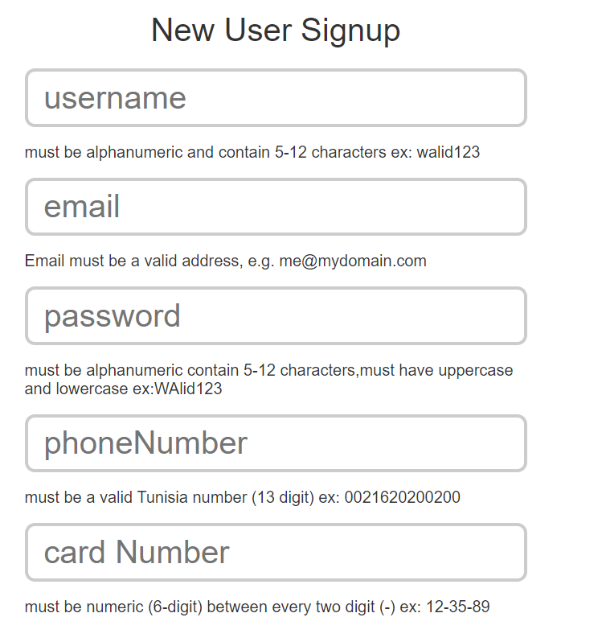

# Regular Expression

in this sprint we are going to create a signup page with validation using RegExp

# Form field

- username
- email
- password
- phoneNumber
- cardNumber

# Form validation

- phoneNumber :

  - must be a valid Tunisia number (13 digit) ex: 0021620200200.

- username :

  - must be alphanumeric and contain 5-12 characters ex: walid123.

- password :

  - must be alphanumeric contain 5-12 characters,must have uppercase and lowercase ex:WAlid123.

- cardNumber :

  - must be numeric (6-digit) between every two digit (-) ex: 12-35-89.

- email

  - must be a valid email

# css

- add green border to the valid field and red for invalid .

# HTML Form

